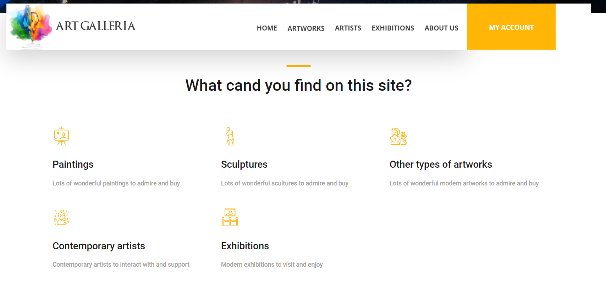

# JavaWebApplication_ArtGallery
# ArtGallery_Website

Features:
1. Login/Signup into the website
2. Go to home page or search for the paintings, sculptures that you want to buy, view the artists and upcoming expositions
3. Add paintings, sculptures to cart
4. Place an order
5. Database connection

# The website pages

## Login

## Home

## Paintings

## Sculptures

## Others

## Artists

## Exhibitions

